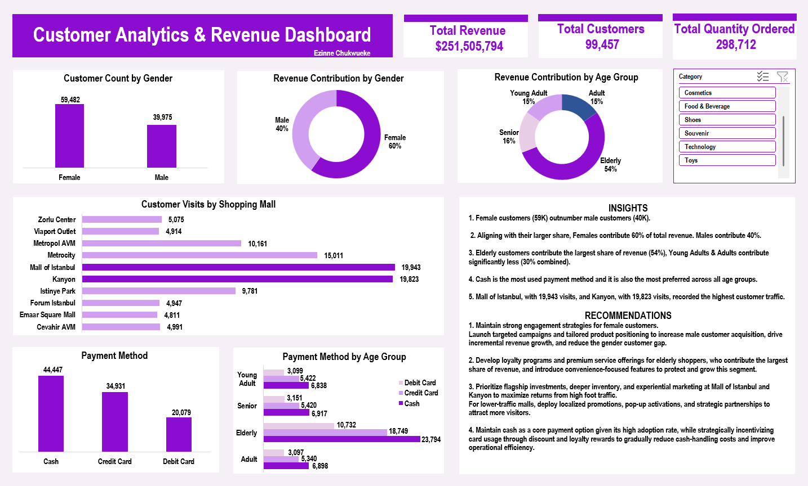

# 📊 Customer Analytics & Revenue Dashboard (Excel)

## 📌 Project Overview

This project presents an interactive, business-focused customer analytics dashboard built in Excel to evaluate customer demographics, revenue performance, shopping behavior, and payment preferences. The analysis was designed to answer key business questions and support data-driven decision-making through actionable insights and recommendations.

---

## 🎯 Business Case

The dashboard was developed to answer the following business questions:

- Which customer groups generate the highest revenue?
- Which gender segment represents the largest customer base?
- How does revenue vary across different age groups?
- Which shopping malls attract the highest customer traffic?
- Which payment methods are most preferred by customers?
- What customer trends can support better business decisions?

---

## 🛠 Tools Used

- Microsoft Excel
- Pivot Tables
- Pivot Charts
- Slicers
- Dashboard Design

---

## 📊 Dashboard Overview

## 🔍 Key Insights

- Female customers represent the largest customer segment and contribute the highest share of total revenue.
- Elderly customers generated the highest revenue among all age groups.
- Mall of Istanbul and Kanyon recorded the highest customer traffic.
- Cash was the most frequently used payment method.
- Revenue patterns differed across customer demographics.

---

## 💡 Business Recommendations

- Strengthen engagement strategies for high-value customer segments to drive customer retention and revenue growth.
- Develop targeted marketing campaigns and tailored product positioning to attract underrepresented customer groups.
- Increase promotional activities and customer engagement initiatives in high-performing shopping malls.
- Encourage greater adoption of digital payment methods while maintaining support for cash transactions.
- Continue monitoring customer behavior and revenue trends to support data-driven business planning.

---

## 📁 Repository Contents

- Dashboard Screenshot
- README.md
